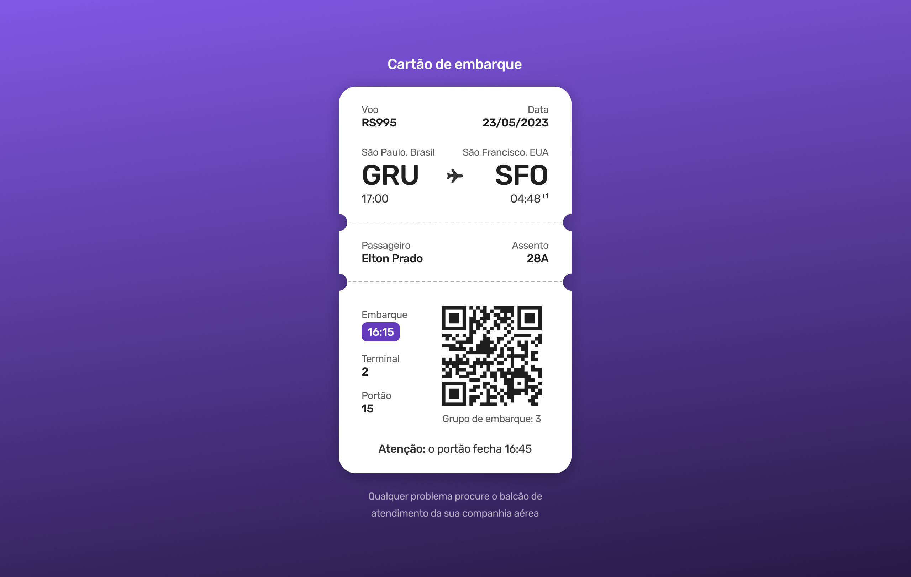

<h1> Boarding pass </h1>

 

<h2> O Projeto </h2>

O projeto do bording pass foi desenvolvido durante os desafios do #BoraCodar da Rocketseat. Foi adicionado ao layout uma animação feita em css que simula o destaque da passagem aérea.  

  

 

Quer conferir como ficou o bording pass? 

[Visite o projeto online]()

 

<h2> O intuito do projeto </h2>

O intuito do projeto foi colocar em prática os conhecimentos acerca de:

- Snippets no VScode
- tags de HTML
- propriedades e valores de CSS
  - Classes utilitárias
  - radial-gradient()
  - mask()
  - align-self
  - grid
  - grid-auto-flow
  - animações

 

<h2> Tecnologias </h2>

Foi utilizado as seguintes tecnologias para desenvolver esse projeto:

- HTML
- CSS
- Git
- GitHub
